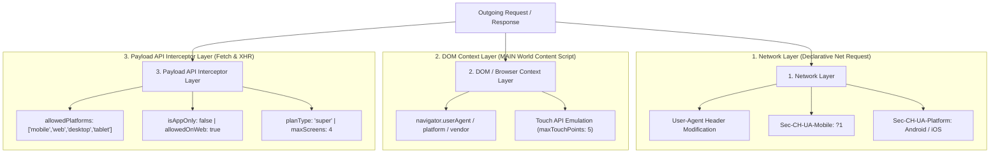

<div align="center">


# MobileForce — OTT Mobile Bypass System

**Bypass OTT Mobile-Only Plan Locks & Unblock Web Playback Across Major Streaming Platforms**

<p align="center">
  <a href="https://developer.chrome.com/docs/extensions/mv3/intro/"></a>
  <a href="LICENSE"></a>
  <a href="https://brave.com/"></a>
  
</p>

</div>

---

## 🌟 Overview

**MobileForce** is a high-performance Chrome & Brave browser extension engineered to bypass restrictive "Mobile-Only" subscription locks imposed by major OTT platforms (such as **Disney+ Hotstar**, **JioCinema**, **SonyLIV**, **Zee5**, and **Amazon Prime Video Mobile Edition**).

By orchestrating **declarative network header modification**, **DOM environment spoofing**, and **subscription payload API transformation**, MobileForce allows you to enjoy your mobile subscription directly on your desktop browser in full resolution.

---

## ✨ Key Features

- 📱 **Latest Flagship Device Profiles**:
  - **Samsung Galaxy S25 Ultra** (Android 15) *(Recommended for Chromium)*
  - **Google Pixel 9 Pro** (Android 15)
  - **iPhone 17 Pro Max** (iOS 19)
  - **iPad Pro 13" (M4)** (iPadOS 18.2)
- 🔓 **Multi-OTT Subscription Bypass Engine**: Automatically intercepts and unblocks payload restriction flags (`allowedPlatforms`, `isAppOnly`, `allowedOnWeb`, `planType`, `maxScreens`).
- 🎨 **Luxury Dark Glassmorphism UI**: Ultra-sleek, monochrome graphite interface built with custom vector iconography and responsive state indicators.
- ⚡ **Zero Performance Overhead**: Powered by Chrome's native `declarativeNetRequest` API and non-blocking asynchronous event bridges.
- ❓ **Built-in System Guide**: Interactive right-side info modal explaining setup steps and technical architecture.

---

## 🌐 Supported OTT Platforms

| Platform | Bypass Target | Strategy |
|---|---|---|
| **Disney+ Hotstar** | Mobile 3 Months / Mobile Plan Lock | User-Agent + Subscription Payload Interceptor (`allowedPlatforms`, `isAppOnly`) |
| **JioCinema** | Mobile-Only Premium Plan | Client-Hints + `device_category` / `is_playback_allowed` Transformation |
| **SonyLIV** | Mobile Subscription Screen Lock | Header Spoofing + `deviceCategory` Payload Patching |
| **Zee5** | App-Only / Mobile Plan Lock | `supportedPlatforms` Expansion + `mobileOnly: false` |
| **Amazon Prime Video** | Mobile Edition Regional Restrictions | `deviceRestriction: "none"` + Error Code Clears |

---

## 🛠️ 3-Layer Bypass Architecture



### Technical Breakdown:
- **Layer 1 (Network Layer)**: Native `declarativeNetRequest` rules modify HTTP headers (`User-Agent`, `Sec-CH-UA-Mobile`, `Sec-CH-UA-Platform`) below the CORS layer.
- **Layer 2 (DOM Context Layer)**: Synchronous `MAIN` world content script overrides `navigator` JS properties before page scripts execute.
- **Layer 3 (Payload Interceptor Layer)**: Intercepts `fetch` and `XMLHttpRequest` JSON responses to automatically patch OTT entitlement objects.

---

## 📥 Installation & Setup

1. **Clone or Download Repository**:
   ```bash
   git clone https://github.com/satiricalguru/Mobileforce-extension.git
   ```
2. **Open Extensions Page**:
   - Open **Chrome** (`chrome://extensions`) or **Brave** (`brave://extensions`).
3. **Enable Developer Mode**:
   - Flip the **Developer mode** toggle in the top-right corner.
4. **Load Unpacked Extension**:
   - Click **Load unpacked** and select the `Mobileforce-extension` directory.
5. **Start Bypassing**:
   - Click the **MobileForce** icon in your browser toolbar.
   - Flip the master toggle **ON**, choose your target device profile (e.g. *Galaxy S25 Ultra*).
   - Perform a **Hard Refresh** (`Cmd + Shift + R` on Mac / `Ctrl + F5` on Windows) on the OTT site.

---

## 📂 Project Structure

```
Mobileforce-extension/
├── manifest.json              # Manifest V3 Extension Configuration
├── LICENSE                    # MIT Open Source License
├── README.md                  # Project Documentation & Guide
├── background/
│   └── service-worker.js      # Dynamic DeclarativeNetRequest Header Engine
├── content/
│   ├── spoof-main.js          # MAIN World Property Overrides & Payload Interceptor
│   └── spoof-bridge.js        # ISOLATED World Chrome Runtime Bridge
├── icons/
│   ├── icon-16.png
│   ├── icon-32.png
│   ├── icon-48.png
│   └── icon-128.png
└── popup/
    ├── popup.html             # Luxury Dark Mode Interface
    ├── popup.css              # Glassmorphism Design System
    └── popup.js               # State & Event Handlers
```

---

## 📄 License

Distributed under the **MIT License**. See [`LICENSE`](LICENSE) for more details.

---

<div align="center">

**MobileForce** — Created for educational & interoperability research purposes.

</div>
